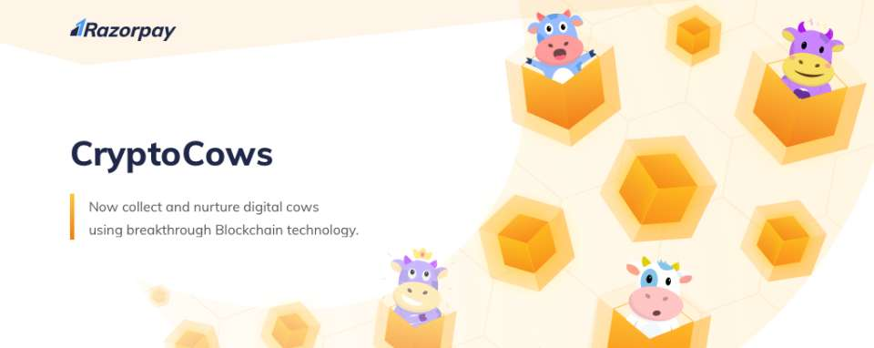

# [CryptoCows](https://razorpay.com/cryptocows/)

##### Virtuous Collectibles for a new India, Powered by Nothing But Blockchain Buzzwords



  * [Abstract](#abstract)
  * [The Problem](#the-problem)
  * [The Solution](#the-solution)
    + [Initial Cow Offering](#initial-cow-offering)
    + [Sanksari Breeding](#sanksari-breeding)
    + [GST: Protocol Tokens, Backed by Moral Virtue](#gst-protocol-tokens-backed-by-moral-virtue)
    + [High Stability](#high-stability)
    + [Decentralized Herds](#decentralized-herds)
  * [In Conclusion](#in-conclusion)

## Abstract

Blockchain and cryptocurrencies remain hot topics today, much as they were a few months ago in late December 2017, when everyone in your office abruptly stopped advising you to invest in them. While the technology itself is still poorly understood, the applications are becoming ever more far-reaching, to the point that a huge opportunity has presented itself for the first dude who successfully builds a blockchain-powered product that his mother can easily use.

In this paper, Razorpay will attempt to be _that dude_.

At its heart, the concept of digital collectibles is easy enough to understand. Common collectibles like coins or stamps or paintings have certain properties, also held by their digital equivalents:

*   Aside from the intangible (and largely unreasonable) joy they afford their owner, **they serve no real function**.
*   Their value is largely determined by **their scarcity**.

Both these properties are easily duplicated for digital collectibles. The one key difference arises from another property of common collectibles:

*   You can touch them.

However, it is the 21st century, and refusing to cede value to something simply because we cannot touch it would appear to be regressive thinking.

The problems with currently available digital collectibles therefore arise from other attributes, many of which are tightly coupled with the nature of the collectible itself (one cannot help but feel sorry for the neglected cat owner who wills himself not to indulge digital feline-themed pass-times, because one day, he believes, his cat will love him back).

These problems listed below, along with a proposal for a revolutionary new type of digital collectible that circumvents the shortcomings of existing alternatives, and serves an additional purpose: that of representing and rewarding **human virtue**, by allowing the easy possession and upkeep of a domestic cow.

## The Problem

In our bid to make blockchain and digital collectibles more approachable to the general public, we must consider obstacles that people of the world face when contemplating the purchase and possession of a cow, as well as cultural obstacles to the adoption of arbitrary feline mascots for a digital collectible, which might at first appear to be a reasonable alternative. Some of the issues are outlined below:

*  **Cows are expensive.** Both the purchase and upkeep of a domestic cow comes with a host of problems. There is precious little information first available when you are purchasing a cow, and the various factors to be considered may seem out of reach for the average Indian.
*  **Cows are insecure.** Where would one keep one's cows? In a cryptographically secure gaushala, with 13ft high walls? Of course not. Cows are therefore insecure, and they can be stolen.
*  **Cows are mortal.** In spite of the good they do for society, cows remain annoyingly transient, in that they eventually die. This is just not done.
*  **Cats are bad luck.**  While possession of a digital cat alone can cause problem, matters are significantly worsened when you consider the possibility of these cats moving and occasionally crossing their owners. A natural progression of the CryptoKitties web app is an interface that allows that cats themselves to be animated. While this may seem like a great idea at first, it will cause widespread panic when a black cat crosses your screen and you are required to walk in a circle holding your laptop over your head, then flip it over twice while reciting passages from _Arthasashtra_, just to avoid dying.
*  **Cats have nine lives.** However, digital cats, that result only as a manifestation of a blockchain-powered asset, are completely indestructible. As these cats will never die, the remaining 8 lives of every catwill never get used. By current estimates that we just made up, there over 300,000 CryptoKitties in existence. This means there are 24 million cat lives that will never see the light of day. Are you sure you want to be involved in inkitticide?
*  **Cats belong to nobody.** Do not be fooled by the claims of those who say otherwise. Cats will always be cats, and they will never belong to you. Cat owners know what we mean. For proof, try calling out to your CryptoKitty by name. Does he respond? Exactly.
*  **Cats breed like, well, cats.** Not only does this come at the high cost of exclusivity, but it also makes you think of your pets as essentially digital perverts. The ideal digital pet is one that you can look up to as a figure of respect, not one that you regularly ask to go get a room.
*  **Cats need to be bought.** The distribution of CryptoKitties is biased towards those with buying power, as even new cats cost ether. This horrible manifestation of chronic capitalism means that the rich get richer and the poor-but-virtuous never get to possess their own digital pet.


## The Solution

The proposed solution to this conundrum combines the virtuous self-satisfaction of owning a cow with the convenience of owning a digital pet. The technology that powers CryptoCows goes above and beyond the circumvention of the above problem, and some of its elements are described below.


### Initial Cow Offering

On a pre-designated date, CryptoCows will launch by going live and beginning the process of adoption of the generation 0 cows. On 1st April, **Utpatti Gau (the genesis cow)** will be adopted, and the following weeks will be marked by continual creation and assignment of more CryptoCows to the early adopters. The token emission strategy will be similar to that followed in several previous ICOs, but has a far higher chance of succeeding, given the [natural proclivity of cows towards emissions](https://www.forbes.com/sites/samlemonick/2017/09/29/scientists-underestimated-how-bad-cow-farts-are/#c97912478a90).

Unlike other ICOs, the initial offering will not be determined by the buying power of the early adopters, but will be governed by more real representations of virtue. The deterministic process that will be used will be a variation of the PoS measure, called the **Proof Of Labour** method, which will take into the account the number of acres that every adopter has ploughed in his/her life. Thus the interests of the Indian farmer are protected.


### Sanksari Breeding

The cow is sacred, and we can all agree that we are not comfortable with the idea of our idols breeding. For this reason, CryptoCows have no breeding process. Every cryptocow is fully sanskari and does not even think of indulging in the mating process.

Instead, the number of CryptoCows in existence can be increased only by the process of asexual procreation, powered by a visit from a **pandit miner**. This pandit miner must necessarily show his crypto investment returns before initiating the process. If he is shown to have purchased large volumes, but then sold everything off just before January 2018, we can trust his decisions.


### GST: Protocol Tokens, Backed by Moral Virtue

The crypto economic protocol described in the above sections will require a protocol token to align financial incentives and offset costs associated with organizing multiple parties around a single technical standard. We're not entirely sure what that means either, but we do agree upon the necessity of a new standard token **GauShalaToken (GST)** to be used for all dealings with CryptoCows, and thus avoid the alternative barter-like system of exchanging cows for cows and cash, which just sounds vulgar. Let's not bring money into all this.


By using a proxy currency in this fashion, it is also possible to ensure that your CryptoCows always maintain **extremely high apparent value**, as long as one does not bother to check the corresponding value of the GauShalaToken (Fig 1). The value of every GauShalaToken is backed by the owner's own moral virtue. The value of your CryptoCow can thus remain fixed in terms of GST, as long as one accepts that the value of your moral virtue is constantly varying with rises and drops in traditional currency. Acche logo ka toh aaj kal zamana hi nahi raha.

This relationship between GST and related assets in this manner are enforced by a very real Smart Contract, part of the code for which is given below:


```java
pragma solidity ^0.4.0;
contract GSTValue {
    // Appropriate value, fixed after consultation with our in-house pandit from ShubhCron
    int private constant fixed_cow_value = 50000;
    function getCryptoCowValueInGst(CryptoCow cow) public {
        return fixed_cow_value;
    }
    function getGstValueInInr(int gst) public {
        return Society.getTheWorthOfMoralVirtueFromAnExternalFunctionThatTotallyWorks()*gst;
    }
}
```


It may seem a hard problem to solve to determine a user's moral character for purposes of calculating the worth of his assets, but with [our new data partners](https://cambridgeanalytica.org/), this is very easily possible. 


### High Stability

GauShalaTokens have extremely low volatility. This is because their value is closely tied to CryptoCows, and cows, as is well known, as essentially [impossible to move](https://youtu.be/VIg2qlngU18?t=1m14s).

This means GauShalaTokens are effectively **immune to unstoppable forces**, even market forces, being themselves tied to an immovable object.


### Decentralized Herds

CryptoCows provides an exciting and as yet unexplored new application of decentralization, a core concept powered by blockchain, namely its use to help fix the traffic problem in many developing Indian cities. The cultivation of CryptoCows is aided by the fact that any herd of CryptoCows must necessarily be **decentralized**, and therefore not cause clogging of roadways, as non-decentralized herds have been known to do.


### In Conclusion

If you are still reading this, we would like to offer our sincerest apologies and remind you that this was done as part of an April Fool's Prank. If you are reading this in the future and CryptoCows is a billion dollar business then please contact someone at Razorpay and help us get our due share of the money.